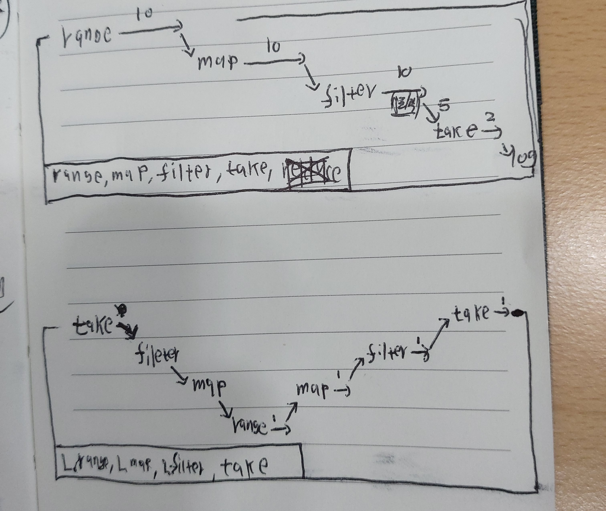

# range, map, filter와 L.range, L.map, L.filter

## 평가 순서 도식도



## 평가 순서(배열)

### range, map, filter, take

- 평가 순서가 range(10개) => map(10개) => filter(10개) => take(5개, 홀수 or 짝수)

```js
// [0, 1, 2, 3, 4, 5, 6, 7, 8...]
// [10, 11, 12, ...]
// [11, 13, 15 ..]
// [11, 13]
//
```

### L.range, L.map, L.filter, take

- 평가 순서가 take(1개, 아래) => ... => L.range(1개, 위) => ... => take(1개, 아래)
- take, filter, map은 위쪽 함수에 의해 평가된 이터레이터를 가지고 있다.

```js
// [0     [1     [2     [3
// 10     11     12     13
// false] true   false] true
//        11]           13]
```
